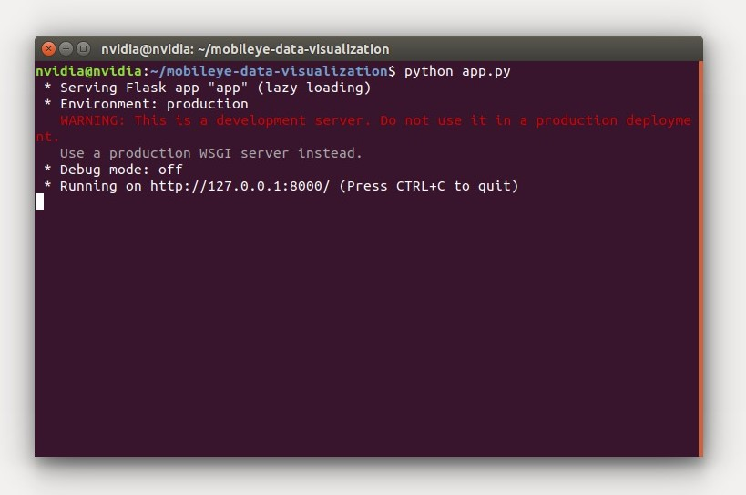
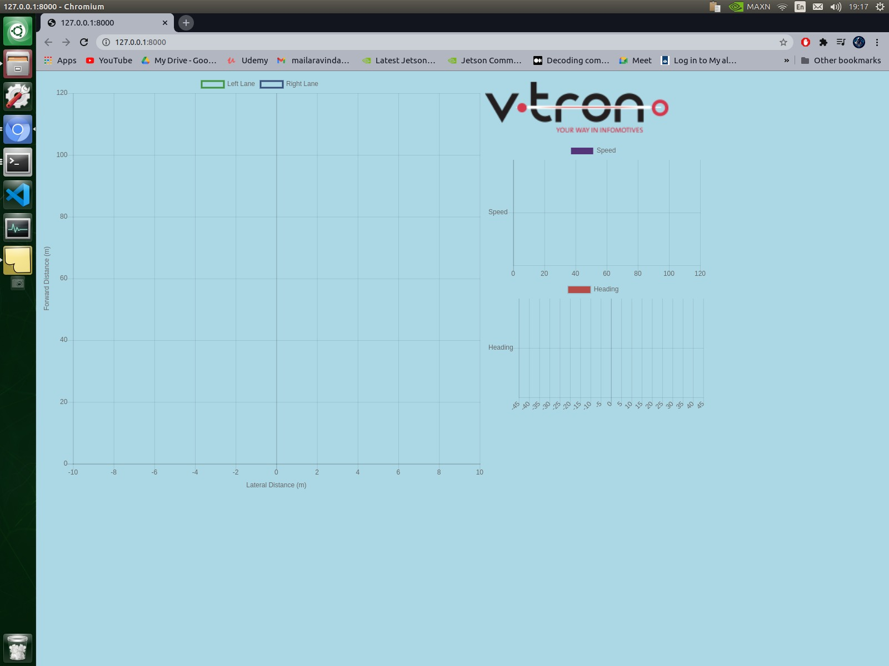

# Mobileye data visualizer 
python scripts to visulaize the data from can and calculate the width of detected lanes

## Instructions 
The code was tested in Nvidia Jetson AGX xavier with dedicated can port.<br> 

## prerequisites
the program requires flask and can drivers.  
If your board does not have Flask, run
```bash
  pip install Flask
```
For enabling CAN on AGX xavier follow the instrcutions from this repo 
```bash
  https://github.com/Aravindseenu/CAN-communication-on-Nvidia-AGX-xavier
```
For other devices initialise the can port as shown: 
```bash
  ip link set can0 type can bitrate 500000 triple-sampling on
  ifconfig can0 up
```

## Running the app
Clone this respository and move into it with
```bash
  git clone https://github.com/Aravindseenu/mobileye-data-visualization
  cd mobileye-data-visualization
```
and run the server with 
```bash
  python app.py
```

when the web link is clicked the following page will appear

Note: the graphs will be generated only when data is recived from the mobileye configured in a vechile

Sample can data is provided to check the working of app 
```bash
  cd can_message
  python can.py 
```
![[output]](./images/output.jpeg)


For lane width calculation execute mobileye_width.py in seperate terminal 
```bash
  python mobileye_width.py
```

to have the camera view ,additional camera is required  instead of app.py execute app_cam.py
```bash
  python app_cam.py
```
![[camera]](./images/camera.png)

